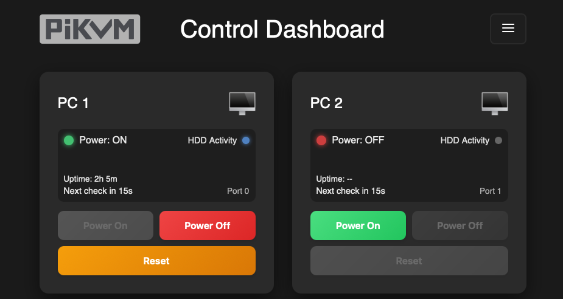

# PiKVM Dashboard

A powerful, customizable web dashboard for managing multiple PCs through your PiKVM device.



## ✨ Features

- **Multi-PC Control** - Manage multiple computers from a single interface
- **Power Management** - Power on, off, reset, and force shutdown
- **Keyboard Shortcuts** - Send common key combinations (Ctrl+Alt+Del, Win+L, etc.)
- **Scheduled Actions** - Schedule power actions for specific times
- **Recurring Schedules** - Daily or weekly recurring actions
- **Conditional Actions** - Smart conditions (only if ON/OFF)
- **Follow-up Actions** - Chain multiple actions with delays
- **Idle Shutdown** - Automatically shut down idle PCs
- **Custom Themes** - 7 preset themes + full color customization
- **Light/Dark Mode** - Easy toggle between modes
- **Custom PC Icons** - Upload your own icons for each PC
- **Action Logging** - Track all actions performed
- **Browser Notifications** - Get notified of completed actions
- **Responsive Design** - Works on desktop, tablet, and mobile

## 📦 Installation

### Quick Start

SSH into your PiKVM and run:

```bash
curl -O https://raw.githubusercontent.com/DanCue44/pikvm-dashboard/main/install.sh
sudo bash install.sh
```

The installer will guide you through entering your PiKVM credentials and configuring the dashboard.

### Update Existing Install

If you already have the dashboard installed, you can update with a single command:

```bash
curl -sSL https://raw.githubusercontent.com/DanCue44/pikvm-dashboard/main/install.sh | sudo bash
```

This will update the files while keeping your settings and data.

> **Note**: The one-liner (`curl | sudo bash`) only works for **updates** where credentials are already saved. For fresh installs, use the interactive two-step command above.

## 📚 Documentation

- [User Guide](docs/USER_GUIDE.md) - Complete guide to using the dashboard
- [Troubleshooting](docs/TROUBLESHOOTING.md) - Common issues and solutions
- [FAQ](docs/FAQ.md) - Frequently asked questions
- [Beta Testing Checklist](BETA_TESTING_CHECKLIST.md) - For testers

## 🚀 Access

After installation, access your dashboard at:

```
https://<your-pikvm-ip>/pikvm-dashboard.html
```

> **Note**: PiKVM uses HTTPS with a self-signed certificate. Your browser may show a security warning - click "Advanced" and proceed to accept the certificate.

## 📋 Requirements

- PiKVM v2, v3, v4, or DIY build
- PiKVM OS (based on Arch Linux ARM)
- Network access to your PiKVM
- One or more PCs connected via ATX control (optional for multi-PC)

## 🔧 What Gets Installed

- Dashboard HTML interface (`/opt/pikvm-dashboard/`)
- Python backend service (`pikvm-dashboard.service`)
- Nginx serves dashboard via PiKVM's web root
- Automatic service startup on boot

## ⚙️ Configuration

On first launch, a setup wizard will guide you through:

1. **Hardware Setup** - ATX switch configuration
2. **PC Configuration** - Name your PCs, set ports, custom icons
3. **Appearance** - Choose theme and colors
4. **Features** - Enable/disable optional features

Access settings anytime via the hamburger menu → Settings.

## 🎨 Themes

Choose from 7 built-in themes or create your own:

- 🎨 Default
- 🌊 Ocean
- 🌅 Sunset
- 🌲 Forest
- 🔥 Fire
- 💜 Purple
- 🌙 Midnight

Each theme supports both light and dark modes.

## 📅 Scheduled Actions

Schedule power actions with powerful options:

- **One-time** - Execute once at a specific date/time
- **Daily** - Repeat every day
- **Weekly** - Choose specific days of the week
- **Conditions** - Only execute if PC is ON/OFF
- **Follow-ups** - Chain additional actions with delays

## 🔄 Updating

To update to the latest version:

```bash
curl -sSL https://raw.githubusercontent.com/DanCue44/pikvm-dashboard/main/install.sh | sudo bash
```

Your settings will be preserved.

## 🗑️ Uninstalling

```bash
sudo systemctl stop pikvm-dashboard
sudo systemctl disable pikvm-dashboard
sudo rm -rf /opt/pikvm-dashboard
sudo rm /etc/systemd/system/pikvm-dashboard.service
sudo rm /etc/nginx/sites-enabled/pikvm-dashboard.conf
sudo systemctl restart nginx
```

## 🐛 Troubleshooting

### Dashboard not loading
```bash
sudo systemctl status pikvm-dashboard
sudo journalctl -u pikvm-dashboard -f
```

### Check nginx configuration
```bash
sudo nginx -t
sudo systemctl restart nginx
```

### Restart the service
```bash
sudo systemctl restart pikvm-dashboard
```

## 🤝 Contributing

Contributions are welcome! Please feel free to submit issues and pull requests.

## 💖 Support

If you find this project useful, consider supporting its development:

- ⭐ **Star this repo** - It helps others discover the project
- 🐛 **Report bugs** - Help improve the dashboard
- 💡 **Suggest features** - Share your ideas
- ☕ **Support on Patreon** - [patreon.com/c/DanCue44](https://www.patreon.com/c/DanCue44)

## 📄 License

MIT License - See [LICENSE](LICENSE) file for details.

## 🙏 Acknowledgments

- [PiKVM Project](https://pikvm.org/) - The amazing KVM-over-IP solution this dashboard extends
- All beta testers and contributors

---

Made with ❤️ by [DanCue44](https://github.com/DanCue44)
